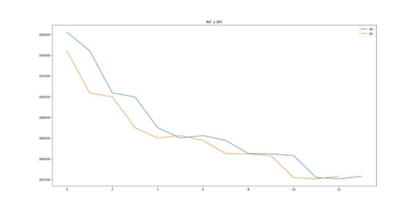

Universidad Veracruzana  Instituto de Investigaciones en Inteligencia Artificial 

**Segmentación de imágenes usando RGB empleando el algoritmo MOG con ajuste de E.M.** 

A partir de una imagen RGB y proporcionando el valor de k (el número de gaussianas a mezclar). Obtener los parámetros de salida µ, ∑, λ con i=1, …, k gaussianas. Para generar la imagen de salida en cada pixel darle el color promedio µ, de la gaussiana mas cercana (la que de mayor probabilidad a ese color).  

Selección de modelo optimo.  

Segmentar la imagen desde k=2 hasta k=15, para cada k guardar la imagen de salida y encontrar la k optima K\* usando el criterio de información AIC. 

Para la realización de este trabajo se utilizaron dos metodologías diferentes para llevar a cabo la implementación del algoritmo MOG con ajuste de E.M., la primera fue programar todas las funciones y ecuaciones utilizadas para realizar el E.M., la segunda es el uso de la librería Scikitlearn que ya tiene implementada la función GMM, para finalmente comparar las imágenes resultantes de ambos métodos y ver qué resultados se pueden obtener. 

Para programar las funciones, primero se obtienen 3 matrices del tamaño de la imagen, donde cada una representa un valor de la componente RGB, de ahí se generan µ, ∑ y λ aleatorios para cada k. Sin embargo, al sacar ∑ aleatoria se descubrió que algunas aleatorias no podían usarse porque son semidefinidas y su determinante es 0, dando error al querer calcular la normal con esa matriz de covarianza, para evitar eso se hace fueron guardando  matrices  aleatorias  que  no  tuvieran  ese  problema  y  esas  eran  las  que  se utilizaron para entrenar. Posteriormente se empieza el algoritmo de E.M. para entrenar estos valores aleatorios, obteniendo las responsabilidades de cada k para cada pixel de la imagen y posteriormente actualizando los µ, ∑ y λ en cada iteración. Finalmente se actualiza la  imagen,  para  esto  se  compara  la  responsabilidad de  todas  las  k  en cada  pixel  y  se selecciona la que tiene mayor valor, y se cambia el color de ese pixel al de la media de la k escogida y se guarda la imagen resultante.  

Para la segunda metodología se hace uso de la librería scikitlearn, la cual tiene implementado  GMM  en  una  función  llamada  GaussianMixture  a  la  cual  se  le pasa un DataFrame 2D y el numero de K deseado y realiza la clasificación de cada pixel y obtiene las µ correspondientes, la limitante que se encontró con esta función es que solo acepta 2D, por lo que no se pueden usar valores RGB, para esto la imagen se convierte a escala de grises con ayuda de Opencv asi cada pixel paso de tener valores (R,G,B) entre 0 y 255 a tener solo un valor (grayscale) con valor en la misma escala de 0 a 255, para la segunda dimensión se pone el valor de 0, asiendo una coordenada (grayscale,0) y así se genera el DataFrame que será usado con la función GaussianMixture, la cual nos regresa una matriz donde cada índice representa un pixel y va a tener como valor la clase k a la que pertenece, con esta matriz se calcula en la imagen original los valores de las µ en RGB, para posteriormente cambiar el color de cada pixel al de la µ de su clase correspondiente. También la propia de función de GaussianMixture nos da el AIC y BIC para cada valor de K y así poder obtener las K optima.  

A continuación, se presentan las imágenes obtenidas para cada valor de K con las dos metodologías implementadas: 

ORIGINAL                           EM Y GMM EN PYTHON                    SCIKITLEARN K=2 

![ref1]

K=3 

![ref1]

K=4 

![ref1]![ref2]

K=5 

![ref1]

K=6 

![ref1]

K=7 

![ref1]

K=8 

![ref1]

K=9 

![ref1]

K=10 

![ref1]

K=11 

![ref1]

K=12 

![ref1]

K=13 

![ref1]

K=14 

![ref1]![ref2]

K=15 

![ref1]

Conclusión:  

El primer método resulto ser muy lento, por lo que no se incluyó el cálculo del AIC para cada k, y así no alentar más el procesamiento de la imagen, ya que para k=2 el tiempo de ejecución es de aproximadamente 3 minutos, pero para k=15 el tiempo rebasa los 40 minutos, siendo esta su mayor limitante. Mientras que la ventaja del segundo método es primero que nada el tiempo, el cual obtiene todas las imágenes de k=2 a k=15 en menos de 5 minutos, lo cual es una mejora muy significativa con respecto al otro, además de dar los valores de AIC y BIC para obtener la K optima sin necesidad de aumentar el tiempo de ejecución.  Sin  embargo,  ambos  métodos  logran  realizar  de  manera  correcta  la segmentación de imágenes que es lo que se buscaba obtener, aunque si se comparan, el modelo que no usa librerías es capaz de recuperar de mejor manera los colores de la imagen, lo cual se podría mejorar en el programa con scikitlearn encontrando la manera de trabajar con las tres dimensiones del RGB. 

Métodos Probabilísticos para la Inteligencia Artificial 

[ref1]: Aspose.Words.89bbbe91-1965-4de8-a36b-e5d0840bb1cd.001.png
[ref2]: Aspose.Words.89bbbe91-1965-4de8-a36b-e5d0840bb1cd.007.png
